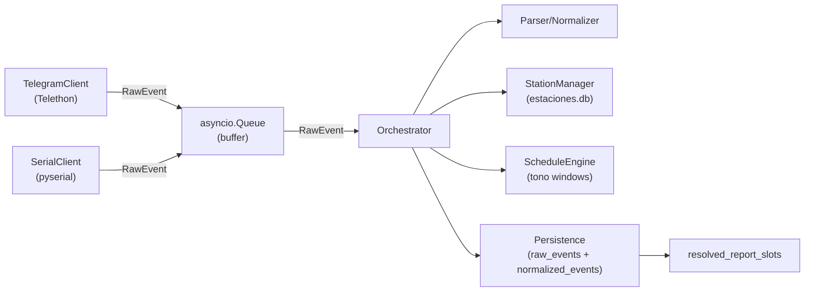

# Telegram Monitor

An asynchronous monitoring service built with [Telethon](https://docs.telethon.dev/),
[Pydantic](https://docs.pydantic.dev/), and
[aiosqlite](https://aiosqlite.omnilib.dev/) that watches a Telegram group,
parses broadcast signal messages, and stores them in a unified SQLite schema.
A separate serial monitor ingests SAME/EAS frames from COM ports into the same
pipeline.

## Features

- **Asynchronous Architecture**: Uses `asyncio` for ingestion, parsing, and database I/O.
- **Pipe and Filter Design**: Events flow through the orchestrator to parsing, normalization, persistence, and deterministic slot resolution.
- **Forward-Only Tono Classification**: Test signals are considered on-time only when they arrive within the 120-second window after each scheduled `HH:45:00` report mark.
- **Robust Persistence**: Uses WAL, busy timeouts, retry-on-lock, and source-aware dedupe rules.
- **Unread-Only Telegram Catch-up**: Restart replay uses the highest persisted Telegram message ID plus a configurable overlap instead of rescanning a fixed recent window.
- **Strict Data Validation**: Uses `Pydantic` before data reaches the database.

## Architecture



## Setup And Installation

**1. Clone the repository and set up Python**

```bash
git clone https://github.com/YourUsername/monitor.git
cd monitor
python -m venv .venv

# Windows
.venv\Scripts\activate

# Linux/macOS
source .venv/bin/activate

pip install -r requirements.txt
```

**2. Configure environment variables**

Copy `.env.example` to `.env`:

```bash
cp .env.example .env
```

Then fill in your [Telethon API credentials](https://my.telegram.org) and the
target Telegram `GROUP_ID`:

```ini
API_ID=12345678
API_HASH=abcdef1234567890
GROUP_ID=-1003054506734
SESSION_NAME=monitor_session
TELEGRAM_CATCHUP_OVERLAP_MESSAGES=20
```

Configure serial settings such as ports and baud rate in `.env` when running
the serial monitor.

**3. Provide station data**

Ensure `databases/estaciones.db` is present in the project root. Runtime now
expects `Estaciones.station_id` to already exist and be valid; startup will
fail if that durable business key is missing, null, or duplicated.

**4. Run Telegram ingestion**

```bash
python main.py
```

To widen the startup replay window for one launch without changing `.env`:

```bash
python main.py --telegram-catchup-overlap-messages 200
```

To replay the last week regardless of the stored watermark for one launch:

```bash
python main.py --telegram-catchup-last-days 7
```

On Windows you can also run:

```bash
run_last_week.bat
```

On first run with a personal account, Telethon will prompt for the phone number
and one-time login code needed to create the `.session` file. The first startup
bootstrap replays full Telegram history into `raw_events`; later restarts only
replay messages newer than the stored Telegram watermark, plus the configured
overlap. The launch flag above can temporarily expand that overlap, but it does
not replace the watermark or limit the first-run bootstrap scan.

**5. Run serial ingestion**

```bash
python serial_main.py
```

## Testing

The test suite uses `pytest` plus `pytest-asyncio`, and persistence tests run
against temporary SQLite databases rather than the operator database.

```bash
pytest tests/ -v
```

## Reprocessing

To re-run parsing after a parser update:

```bash
python reprocess_raw_events.py --source telegram --since 2026-03-01 --replace
```

.\.venv\Scripts\python.exe -m pip install -r requirements.txt
.\.venv\Scripts\python.exe reprocess_raw_events.py --source telegram --since 2026-04-09 --replace

If `--replace` is omitted, new normalized rows are appended.

## Logs And Databases

- Ingestion writes to `databases/mensajes.db` tables: `raw_events`, `normalized_events`, and `resolved_report_slots`.
- `pruebas` collects off-schedule `tone=0` events where `report_slot` is `NULL`.
- `alertas` collects `EQW` events that fall outside report windows where `report_slot` is `NULL`.
- Application logs go to `logs/app.log`.
- Regex parsing misses go to `logs/parsing_errors.log`.
- For calendar-day views of all events, use `get_events_by_station_local_date`.
- For tono-window queries, use `get_events_by_station_date`.

## Data Model Notes

- Telegram keeps durable idempotency by Telegram message ID.
- Telegram restart catch-up uses the highest stored numeric Telegram `source_event_id` as the watermark and replays unseen history with a 20-message overlap by default.
- `--telegram-catchup-overlap-messages X` expands that restart overlap for the current launch only, using `max(config overlap, X)`.
- `--telegram-catchup-last-days N` ignores the stored watermark for that launch and replays Telegram messages from the last `N` days.
- Serial `source_event_id` values are trace identifiers, not dedupe keys.
- `station_id` is the durable business key in `estaciones.db` and must be preserved across edits and imports.
- Rows with `station_id=NULL` remain in `normalized_events` for audit and future reprocessing, but are excluded from `resolved_report_slots`.

## Assumptions

- Telegram ambiguity uses `CONFIDENCE_RESOLVE_THRESHOLD`; if confidence drops below it, `station_id=NULL` is stored.
- Serial framing assumes an `NNNN` terminator. Oversized frames are stored with partial parse status, the buffer is reset, and reading resumes without carryover.
- SAME header year is inferred from `received_at` and recorded in payload metadata.
