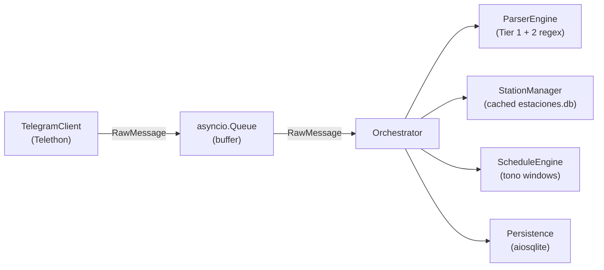

# Telegram Monitor

An asynchronous, robust application built with [Telethon](https://docs.telethon.dev/), [Pydantic](https://docs.pydantic.dev/), and [aiosqlite](https://aiosqlite.omnilib.dev/) that continuously monitors a designated Telegram group, parses highly specific broadcast signal messages, classifies their timing, and records them in a local SQLite database for reporting.

## Features

- **Asynchronous Architecture**: Fully relies on `asyncio` to continuously ingest Telegram messages without blocking parsing or database I/O.
- **Pipe and Filter Design**: Messages flow cleanly through an `Orchestrator` to a two-tier RegEx `ParserEngine`, then a `ScheduleEngine`, and finally hit `Persistence`.
- **Intelligent Tono Classification**: Validates whether test signals are broadcasted strictly within 8 designated ±2 minute daily reporting windows.
- **Robust Persistence**: Utilizes `aiosqlite` with retry-on-lock logic and idempotent `telegram_id` validation to handle bursts and prevent duplication.
- **Strict Data Validation**: Uses `Pydantic` to ensure parsed data is correctly formatted before reaching the database.

## Architecture



## Setup & Installation

**1. Clone the repository and setup Python**
```bash
git clone https://github.com/YourUsername/monitor.git
cd monitor
python -m venv .venv

# Windows
.venv\Scripts\activate
# Linux/macOS
source .venv/bin/activate

pip install -r requirements.txt
```

**2. Configure Environment Variables**
Copy the `.env.example` file to `.env`:
```bash
cp .env.example .env
```
Open `.env` and fill out your [Telethon API credentials](https://my.telegram.org) and the target Telegram `GROUP_ID`. Ex:
```ini
API_ID=12345678
API_HASH=abcdef1234567890
GROUP_ID=-1003054506734
SESSION_NAME=monitor_session
```

**3. Provide Station Data**
Ensure `databases/estaciones.db` is present in your project root. The system requires this SQLite database to resolve station phone numbers and names on startup.

**4. Run**
```bash
python main.py
```
> **Note on first run**: If you are logging in with a personal account, you will be prompted via standard input to provide a phone number and a one-time login code received within the Telegram Client to generate your `.session` file.

## Testing
This project maintains 100% logic coverage across the Regex Parser and the Schedule logic.
```bash
pytest tests/ -v
```

## Logs & Databases
- Incoming data is parsed and dropped into **`databases/mensajes.db`**.
- Detailed application logging outputs to **`logs/app.log`**.
- Regex matching gaps are funneled specifically to **`logs/parsing_errors.log`**.
